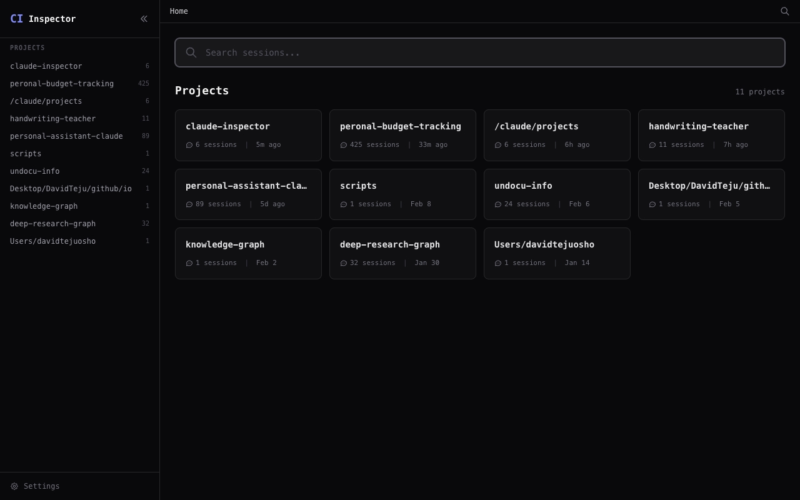
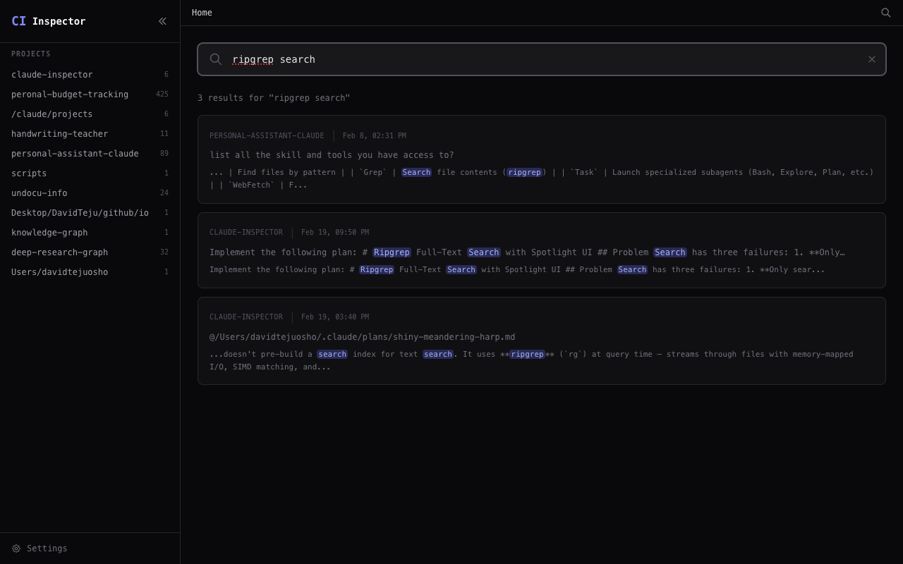
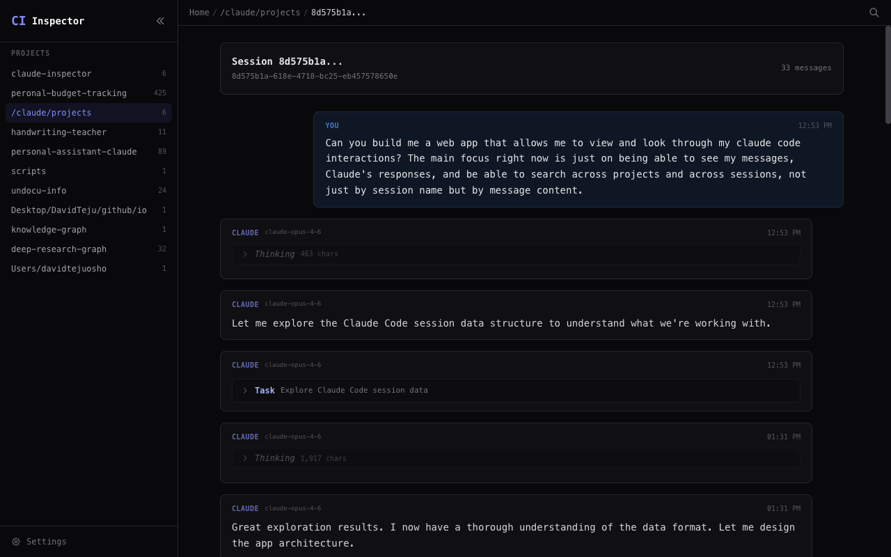

# Claude Inspector

A local web UI for browsing, searching, and interacting with your [Claude Code](https://docs.anthropic.com/en/docs/claude-code) sessions. Claude Code stores all conversations as JSONL files in `~/.claude/projects/` — this app gives you a searchable, navigable interface to explore past sessions and run live ones.



## Features

- **Live sessions** — start new Claude Code sessions directly from the browser. Stream responses in real-time, answer permission requests, respond to questions, and track token costs — all through the web UI. Powered by the [Claude Agent SDK](https://www.npmjs.com/package/@anthropic-ai/claude-agent-sdk).

- **Ripgrep-powered full-text search** — searches actual conversation content across all sessions, not just metadata. Results stream in progressively via SSE with highlighted match snippets.



- **Session viewer** — full conversation renderer with user/assistant threading, collapsible tool calls with paired input/result, collapsible thinking blocks, and syntax-highlighted code blocks (shiki).



- **Project browser** — lists all projects with session counts and relative timestamps
- **Session list** — sortable table per project with summaries, first prompts, message counts, and git branches
- **Light/dark theme** — toggle between light and dark modes, or follow system preference

## Quick Start

```sh
npm install
npm run dev
```

Open [http://localhost:5173](http://localhost:5173).

## Configuration

By default, reads data from `~/.claude/`. Override with the `CLAUDE_DATA_PATH` environment variable:

```sh
CLAUDE_DATA_PATH=/path/to/claude/data npm run dev
```

### Optional: Session summaries

Add an Anthropic API key in Settings to auto-generate short titles for sessions using Haiku. Without it, the first user prompt is shown as the title instead.

## How Search Works

Search is **SQLite-first**: a background reconciler indexes session metadata, message text, tool usage, branches, and token counts into a local SQLite database. Queries run against this index for fast, structured search.

**Structured query filters:**
- `tool:Read` — sessions that used a specific tool
- `branch:main` — sessions on a specific git branch
- `is:error` — sessions with API errors
- `is:subagent` — subagent sessions only
- `has:tokens` / `has:cost` — sessions with token usage data

**Fallback:** Use `mode:raw` (or `debug:raw` / `source:raw`) to force the legacy [ripgrep](https://github.com/BurntSushi/ripgrep) path, which scans JSONL files directly with `--fixed-strings` (user input is never interpreted as regex).

Results stream to the client via Server-Sent Events for progressive rendering.

## Tech Stack

- **SvelteKit 2** + **Svelte 5** (runes)
- **Tailwind CSS v4**
- **shiki** — syntax highlighting
- **marked** — markdown rendering
- **@vscode/ripgrep** — full-text search
- **@anthropic-ai/claude-agent-sdk** — live session management
- **better-sqlite3** — session index cache
- **TypeScript** throughout

## Architecture

```
src/
├── lib/
│   ├── types.ts                          # Shared TypeScript interfaces
│   ├── utils.ts                          # Shared utilities (date formatting, highlighting)
│   ├── shared/
│   │   ├── active-session-types.ts       # Types for live session state and events
│   │   ├── models.ts                     # Model definitions
│   │   ├── permission-modes.ts           # Permission mode constants
│   │   └── state-colors.ts              # Session state → color mapping
│   ├── stores/
│   │   ├── active-session.svelte.ts      # Live session client state
│   │   ├── new-session-modal.svelte.ts   # New session modal state
│   │   └── theme.svelte.ts              # Light/dark theme preference
│   ├── server/
│   │   ├── paths.ts                      # Data root resolution (~/.claude or env override)
│   │   ├── projects.ts                   # Project listing, dir name parsing
│   │   ├── project-id.ts                 # Project ID encoding/decoding
│   │   ├── sessions.ts                   # Session index reading, JSONL fallback scanning
│   │   ├── session-discovery.ts          # JSONL file discovery and scanning
│   │   ├── session-metadata.ts           # Session metadata extraction from JSONL
│   │   ├── session-schema.ts             # JSONL record parsing and type definitions
│   │   ├── session-adapters.ts           # Session data format adapters
│   │   ├── session-parser.ts             # JSONL stream parser
│   │   ├── session-index-sqlite.ts       # SQLite-backed session index cache
│   │   ├── session-manager.ts            # Live session lifecycle (start, stream, interact)
│   │   ├── active-pids.ts               # Active session process tracking
│   │   ├── messages.ts                   # Message threading, tool pairing
│   │   ├── search.ts                     # Ripgrep-based full-text search with SSE streaming
│   │   ├── reconciler.ts                 # Background session index builder
│   │   ├── config.ts                     # App configuration (API key, etc.)
│   │   └── type-guards.ts               # Shared type guard utilities
│   └── components/
│       ├── Sidebar.svelte                # Project navigation
│       ├── TopBar.svelte                 # Breadcrumbs + search icon
│       ├── BrandMark.svelte              # App logo
│       ├── ProjectCard.svelte            # Project summary card
│       ├── SearchResultCard.svelte       # Search result with highlighted snippet
│       ├── MessageThread.svelte          # Conversation renderer (historical)
│       ├── ActiveMessageThread.svelte    # Conversation renderer (live sessions)
│       ├── StreamingAssistantMessage.svelte # In-progress assistant response
│       ├── UserMessage.svelte            # User message bubble
│       ├── AssistantMessage.svelte       # Assistant message block
│       ├── ToolUseBlock.svelte           # Collapsible tool call + result
│       ├── ToolCallGroup.svelte          # Grouped tool calls
│       ├── ThinkingBlock.svelte          # Collapsible thinking block
│       ├── MarkdownContent.svelte        # Markdown → HTML with code extraction
│       ├── CodeBlock.svelte              # Syntax-highlighted code via shiki
│       ├── Composer.svelte               # Message input for live sessions
│       ├── SessionControls.svelte        # Session action buttons (interrupt, etc.)
│       ├── CostDisplay.svelte            # Token usage and cost display
│       ├── PermissionBanner.svelte       # Permission request prompt
│       ├── AskUserQuestion.svelte        # Agent question prompt
│       └── NewSessionModal.svelte        # New session creation dialog
├── routes/
│   ├── +layout.svelte                    # Root layout: sidebar + top bar
│   ├── +layout.server.ts                 # Load project list
│   ├── +page.svelte                      # Home: spotlight search + project grid
│   ├── projects/[projectId]/             # Session list for a project
│   ├── session/[projectId]/[sessionId]/  # Message viewer (historical + live)
│   ├── settings/                         # API key configuration
│   └── api/
│       ├── search/                       # SSE search endpoint
│       └── session/                      # Live session APIs
│           ├── start/                    #   Start a new session
│           ├── active/                   #   List active sessions
│           └── [sessionId]/
│               ├── stream/              #   SSE event stream
│               ├── send/                #   Send user message
│               ├── question/            #   Respond to agent question
│               ├── permission/          #   Grant/deny permission
│               ├── interrupt/           #   Interrupt session
│               └── config/              #   Session configuration
└── app.css                               # Tailwind v4 theme
```

## Scripts

```sh
npm run dev          # Start dev server
npm run build        # Production build
npm run preview      # Preview production build
npm run check        # TypeScript checking
npm run lint         # ESLint
npm run lint:fix     # ESLint with auto-fix
```

## License

MIT
